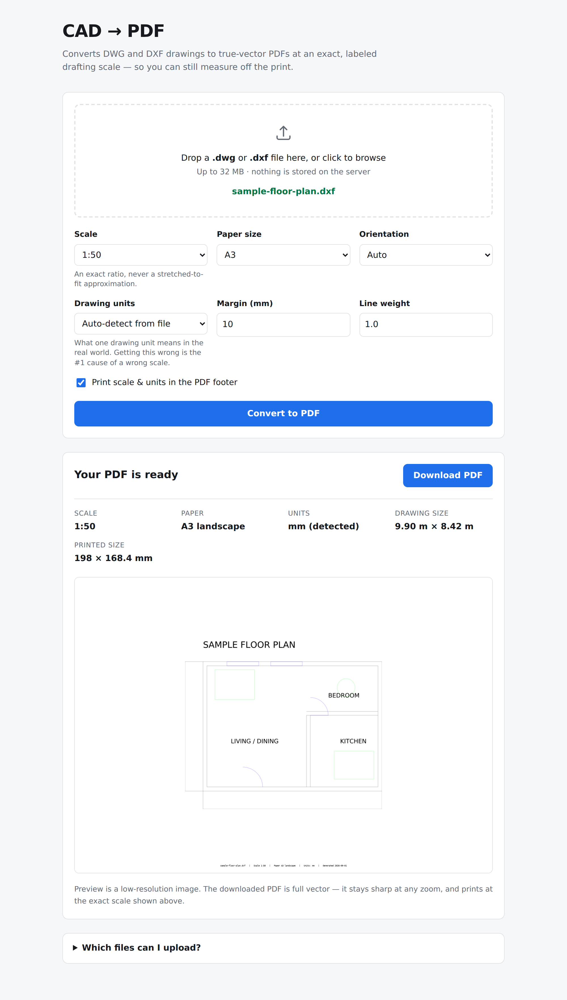

# cad2pdf

[](https://github.com/fishewb-del/CAD2PDF/actions/workflows/ci.yml)

A **web app** that converts CAD drawings (`.dwg` / `.dxf`) into PDFs while
preserving full geometric accuracy and a correct, labeled print scale —
the way a real CAD plotter works, not an image-resize tool.

Open it in a browser, drop in a drawing, pick a scale and paper size, and
download a PDF you can still take measurements off.



## Why this is different from "just export a PDF"

Many quick converters rasterize the drawing or auto-fit it to a page,
which silently changes the scale and blurs fine detail. `cad2pdf`:

1. **Draws vectors, not pixels.** Every line, arc, circle, polyline, hatch,
   dimension and text object is rendered as a true vector path into the PDF,
   so nothing pixelates and it stays sharp at any zoom.
2. **Uses an exact, known scale.** You either pick a real drafting scale
   (`1:50`, `1:100`, …) or let it auto-pick the largest *standard* scale
   (1:1, 1:2, 1:5, 1:10, 1:20 … 1:5000) that fits the paper — never an
   arbitrary stretch factor. One drawing unit always maps to a precise,
   calculable number of millimetres on paper.
3. **Reads the drawing's own units.** A "20 × 10" drawing is a desk in
   millimetres but a building in metres. cad2pdf reads the DXF `$INSUNITS`
   header so it scales correctly instead of guessing — and tells you what
   it detected. You can always override it.
4. **Refuses to lie.** If the drawing genuinely doesn't fit the requested
   paper at the requested scale, it says so with the exact numbers rather
   than silently shrinking or cropping the drawing.
5. **Labels the output.** The PDF footer records the source file, scale,
   paper size, orientation and units, so anyone opening it later knows how
   to measure off it.

## Run it

### With Docker (recommended — includes DWG support)

```bash
docker build -t cad2pdf .
docker run --rm -p 8000:8000 cad2pdf
```

Open <http://localhost:8000>.

The image builds LibreDWG's `dwg2dxf` in a first stage so `.dwg` uploads
work out of the box; the final image only carries the ~17 MB binary.

### With Python directly

```bash
pip install -r requirements.txt
python app.py                     # http://localhost:5000
```

or for production:

```bash
gunicorn app:app --bind 0.0.0.0:8000 --workers 1 --threads 4 --timeout 120
```

DXF works immediately. For `.dwg` support you also need LibreDWG's
`dwg2dxf` on `PATH` (see [DWG support](#dwg-support)); without it the app
still runs and simply asks users to upload DXF instead.

### Deploying (to get a shareable URL)

**Never deployed anything before?** Follow [RENDER.md](RENDER.md), a
click-by-click walkthrough that puts this online for free on Render in about
20 minutes, with no terminal and no credit card. [DEPLOY.md](DEPLOY.md)
covers the other hosts.

The app has to run on a server — it can't be a static page, since it needs
Python (ezdxf/matplotlib) and the LibreDWG binary. Configs for two hosts are
included; both build the Dockerfile, so DWG support comes with them.

**Render** (recommended free option) — `render.yaml` is a blueprint:
New → Blueprint → pick this repo → Apply. You get
`https://<name>.onrender.com`, and every push to the connected branch
redeploys automatically. The blueprint targets the free plan and sizes the
app for it: 1 gunicorn worker, a 16 MB upload cap, shorter timeouts. Free
instances sleep when idle (the first request after a nap takes ~30-60s to
wake). Full walkthrough: [RENDER.md](RENDER.md).

**Fly.io** — `fly.toml` is ready:

```bash
fly launch --copy-config --now      # first deploy, creates the app
fly deploy                          # subsequent deploys
fly open                            # opens the URL
```

Any other Docker host (Railway, Cloud Run, a VPS) works with the Dockerfile
as-is. There's also a `Procfile` for Heroku-style buildpack hosts, though
those won't have `dwg2dxf` unless you install it yourself — DXF still works.

The LibreDWG build stage adds a few minutes to the *first* image build; it's
cached afterwards.

| Env var | Purpose | Default |
|---|---|---|
| `PORT` | Port to listen on | `8000` (Docker) / `5000` (`python app.py`) |
| `CAD2PDF_MAX_UPLOAD_MB` | Upload size limit | `32` |
| `CAD2PDF_DEFAULT_PAPER` | Sheet size pre-selected in the UI | `ARCH D` |
| `CAD2PDF_DWG2DXF` | Path to the `dwg2dxf` binary | `dwg2dxf` (on `PATH`) |
| `CAD2PDF_DWG_TIMEOUT` | Max seconds for a DWG→DXF conversion | `120` |
| `WEB_CONCURRENCY` | Gunicorn worker processes | `1` |
| `WEB_THREADS` | Threads per worker | `4` |
| `GUNICORN_TIMEOUT` | Seconds before a stuck request kills its worker | `120` |
| `CAD2PDF_USERNAME` | Username for the optional password gate | `cad` |
| `CAD2PDF_PASSWORD` | Set this to require a login. Unset = no gate | *(unset)* |

Workers each load matplotlib and hold a whole drawing while rendering, so
one worker per 512 MB of memory is the right ratio. Threads give you
concurrency without the memory cost.

### Password gate

Setting `CAD2PDF_PASSWORD` puts the whole app behind an HTTP basic-auth
prompt. `/healthz` deliberately stays open, since hosts poll it to decide
whether a deploy succeeded. Leave the variable unset and behaviour is
unchanged.

### Status endpoints

| Path | What it is |
|---|---|
| `/healthz` | Liveness probe. Cheap, always open, returns `{"status": "ok"}` |
| `/status` | Deployment dashboard: which GitHub commit is live, whether DWG support and fonts built, current limits and versions |
| `/api/status` | The same information as JSON |
| `/api/preview` | POST a drawing, get back zoomable SVG (or a raster fallback) for the viewer |

On Render, `/status` reads the `RENDER_GIT_*` variables Render injects at
build time, so it links straight back to the deployed commit on GitHub. On
any other Docker host, pass `CAD2PDF_GIT_REPO`, `CAD2PDF_GIT_BRANCH` and
`CAD2PDF_GIT_COMMIT` to get the same links.

## Drawing viewer

Pick a file and the drawing appears before you convert anything: drag to
pan, scroll or pinch to zoom, double-click to zoom in, **Fit** to reset.
The preview is vector, so it stays sharp all the way down to dimension
text, and it shows the *drawing* rather than the plotted sheet - no paper,
no margin, no scale applied. It is there to answer "is this the right file
and did the geometry come across" before you commit to a conversion.

Drawings dense enough to make a multi-megabyte SVG are re-rendered
simplified: text becomes blocks and line styles collapse to solid, which
cuts the file several times over while keeping the drawing readable at a
glance. It stays vector, so it still zooms. The PDF is unaffected and
always carries the full drawing.

The preview is rendered by ezdxf's own SVG backend rather than through
matplotlib. On a 3,400-entity drawing that is the difference between 11
seconds and 2, and on a 0.1 CPU instance the matplotlib path overran the
worker timeout entirely and the viewer appeared to hang. The PDF still goes
through matplotlib, because that is what gives exact control over page
geometry and therefore the printed scale: the preview is for looking at,
the PDF is the thing that has to measure true.

## Sheet sizes

Architectural and ANSI sheets are first-class, since that is what a US
drawing set is plotted on:

| Group | Sizes |
|---|---|
| Architectural | ARCH A (9×12), B (12×18), C (18×24), **D (24×36)**, E1 (30×42), E (36×48) |
| ANSI / US office | LETTER, LEGAL, TABLOID (11×17), ANSI C (17×22), D (22×34), E (34×44) |
| ISO A series | A4, A3, A2, A1, A0 |

All dimensions in inches except the ISO series. Custom sheets work too,
in either unit: `600x900` and `600x900mm` are millimetres, `24x36in` is
inches.

The UI pre-selects `ARCH D`; set `CAD2PDF_DEFAULT_PAPER` to change it.

## Fonts

ezdxf needs a real TrueType font to draw TEXT, MTEXT, dimensions and block
attributes. A slim container image ships none, and without one every
drawing containing text fails with *"no fonts available, not even fallback
fonts"* - while a drawing without text converts perfectly, which makes the
problem easy to miss.

The Docker image installs `fonts-liberation` (metric-compatible with Arial,
Helvetica, Times New Roman and Courier New, which is what CAD text styles
ask for) and `fonts-dejavu-core`. On top of that, `cad2pdf.fontsetup`
registers the DejaVu fonts bundled inside matplotlib whenever the host has
none of its own, so a bare `pip install` on a fontless machine still works.

`/status` reports how many fonts the running instance can see.

## DWG support

`.dwg` is Autodesk's closed binary format and can't be parsed directly.
The app shells out to [LibreDWG](https://www.gnu.org/software/libredwg/)'s
`dwg2dxf` to convert it to DXF first — coordinates, layers, colours and the
`$INSUNITS` header all survive, so the scale stays exact.

The Docker image builds it for you. To install it manually:

```bash
curl -sSLO https://github.com/LibreDWG/libredwg/releases/download/0.13.3/libredwg-0.13.3.tar.gz
tar xzf libredwg-0.13.3.tar.gz && cd libredwg-0.13.3
./configure --disable-python --disable-bindings --disable-shared --enable-static --disable-werror
make -j"$(nproc)"
sudo cp programs/dwg2dxf /usr/local/bin/ && sudo strip /usr/local/bin/dwg2dxf
```

Very old or very new DWG revisions occasionally fail to parse. When that
happens the app says so and suggests *Save As → DXF* from your CAD program,
which always works.

## Malformed DXF files

Machine-generated DXF is often not quite legal DXF, and `dwg2dxf` is a
common source of it: a multi-line note from the original drawing is written
out with its line breaks intact, even though a DXF value has to be exactly
one line. The second line then lands where the next group code belongs and
a strict reader stops dead:

```
Invalid group code "N GROUP FACILITY SOLUTIONS, INC. ON COMPLETION OF WORK, ..." at line 95113.
```

Nothing is wrong with the drawing — every wall, dimension and layer in it is
readable — so cad2pdf repairs the file rather than refusing it. It escalates
only as far as it has to:

| Stage | What it does | Data loss |
|---|---|---|
| `ezdxf.readfile` | Strict read. What a clean file gets. | none |
| `ezdxf.recover` | Repairs damaged structure. | none |
| stitch + recover | Rejoins string values wrapped across lines, then recovers. | none |
| `ezdxf.explore` | Salvage mode: skips anything that isn't a tag. | likely |

Anything past the first stage puts a note on the preview, the result panel
and the CLI's stderr, so you know the file you were sent is malformed even
though the plot came out fine. The PDF is exact and to scale either way —
repair happens on the way in, never to the geometry.

## Privacy

Uploads are processed in a per-request temporary directory that is deleted
as soon as the response is sent. Nothing is written to a database or kept on
disk, and the PDF is handed back in the same response.

## Command line

The same converter is also available as a CLI:

```bash
pip install -e .
cad2pdf drawing.dxf out.pdf --scale 1:100 --paper A3 --units mm
```

| Option | Description | Default |
|---|---|---|
| `--scale N:M` | Print scale, e.g. `1:100`. Omit to auto-fit. | auto |
| `--paper` | `A0`–`A4`, `LETTER`, `LEGAL`, `TABLOID`, or `WIDTHxHEIGHT` mm | `A4` |
| `--orientation` | `auto`, `portrait`, `landscape` | `auto` |
| `--units` | `mm`, `cm`, `m`, `in`, `ft` | auto-detect |
| `--margin` | Margin around the drawing, mm | `10` |
| `--no-label` | Suppress the PDF footer | off |
| `--line-width-scale` | Multiplier on line widths | `1.0` |

(The CLI takes DXF; convert DWG with `dwg2dxf` first.)

## How the scale math works

Given a drawing's bounding box (in drawing units) and a target scale `1:N`:

```
plotted_width_mm  = bbox_width_units  * units_to_mm(units) / N
plotted_height_mm = bbox_height_units * units_to_mm(units) / N
```

The matplotlib `Axes` is placed on the figure at exactly
`plotted_width_mm × plotted_height_mm` (converted to inches), and its data
limits are set to the drawing's exact bounding box with an equal aspect
ratio. That fixes the mapping from drawing units to page millimetres at
precisely `1/N`, with no auto-fit distortion — the same guarantee a licensed
CAD plotter gives you.

Two rendering-library defaults actively fight this, and both are explicitly
overridden in `cad2pdf/converter.py`:

- `MatplotlibBackend` resizes the figure to the drawing's aspect ratio on
  `finalize()`, which would discard the computed paper size and scale.
- `ezdxf` assumes a **dark** CAD background, so default-coloured (ACI 7)
  entities resolve to **white** — invisible on white paper. On a real
  structural drawing this silently dropped every dimension string and
  annotation while still producing a valid-looking PDF.

Both are covered by regression tests.

## Development

```bash
pip install -r requirements-dev.txt
pytest
```

The suite checks the things that would otherwise fail silently: that the
actual PDF page dimensions (read back with `pypdf`) match the requested
paper size, and that the rendered page actually has ink on it rather than
being a correctly-sized blank sheet. To also run the DWG end-to-end test:

```bash
CAD2PDF_SAMPLE_DWG=/path/to/a/real.dwg pytest
```
